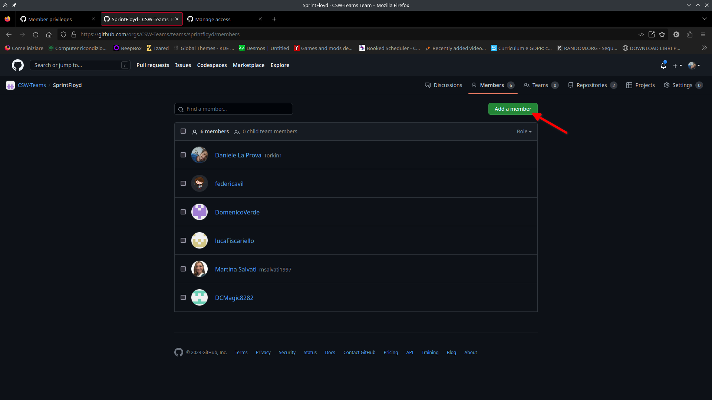

# CSW-Teams
[CSW-Teams](https://github.com/CSW-Teams) è il nome dell'organizzazione su GitHub a cui è delegato il possesso delle repository [MS3](https://github.com/CSW-Teams/MS3) e [MS3-docs](https://github.com/CSW-Teams/MS3-docs), che contengono rispettivamente il codice e la documentazione relative al progetto Medical Staff Shift Scheduler iniziato nel corso di Costruzione del SoftWare nell'anno accademico 2022/2023.

Questa guida assume che si ha familiarità con l'utilizzo di GitHub per progetti personali o di gruppo che non coinvolgono necessariamente l'uso di Organizzazioni.
Inoltre, questa guida punta a spiegare brevemente gli aspetti salienti piuttosto che essere completa ed esaustiva. Riferirsi alle guide in rete per ulteriori dettagli.

## Se sei un membro di SprintFloyd
Tira un sospiro di sollievo, perché il tuo ruolo è molto semplice. L'unica tua mansione che andrà svolta sarà di aggiungere il PO e lo SM all'organizzazione come Owners. Per farlo, segui i passaggi indicati in [Aggiungere un Dev all'organizzazione](#aggiungere-un-dev-a-csw-teams), con la differenza di assicurarti che il PO e lo SM abbiano il ruolo `Owner` nell'organizzazione.

Se questa mansione è già stata svolta, questa sezione non serve più e può essere cancellata.

## Se sei un PO/SM
Se non è stato già fatto, è necessario chiedere a un membro di SprintFloyd di registrarla come owner dell'organizzazione.

### Aggiungere un Dev a CSW-Teams
È sufficiente cliccare sul bottone dedicato e specificare l'username del membro del DevTeam (D'ora in poi Dev) registrato su GitHub.

Di default, il Dev sarà invitato a partecipare all'organizzazione con i privilegi di `admin`. È possibile cambiare ciò nelle impostazioni dell'organizzazione.

Se si vuole che i Devs siano in grado di autogestirsi l'organizzazione in completa autonomia è necessario concedergli il ruolo di `Owner` nell'organizzazione. Per farlo, per ognuno di essi cliccare sui tre puntini -> Change role e selezionare Owner.
 

## Se sei un membro del DevTeam
Per poter accedere alla repository del progetto è necessario prima richiedere la registrazione all'organizzazione CSW-Teams dal PO o dallo SM.

### Creare un Team
È caldamente consigliato che tutti i Devs di un DevTeam creino un nuovo Team all'interno di CSW-Teams. Per farlo, cliccare su `New Team` e compilare i campi richiesti.

Per aggiungere membri al Team, andare sulla pagina dedicata al Team e cliccare su `Add a Member`. Se l'utente specificato non fa ancora parte dell'organizzazione, verrà automaticamente invitato a unirsi.

### Assegnare un Team a una repository
Se si dispone di un Team è possibile assegnare tutti i membri di quel Team a una Repository dell'organizzazione. Per farlo, basta cliccare il bottone apposito nella pagina di configurazione della repository. È consigliato assegnare al team il privilegio `Admin` affinché abbiano pieni poteri sulla repository.

### Linkare un progetto
È possibile usare i Progetti di GitHub come Product Backlog e Sprint Backlog.

A seguito della creazione di un progetto, esso risulterà come progetto dell'organizzazione. Per farlo apparire tra i progetti di una repository, è necessario linkarlo.

